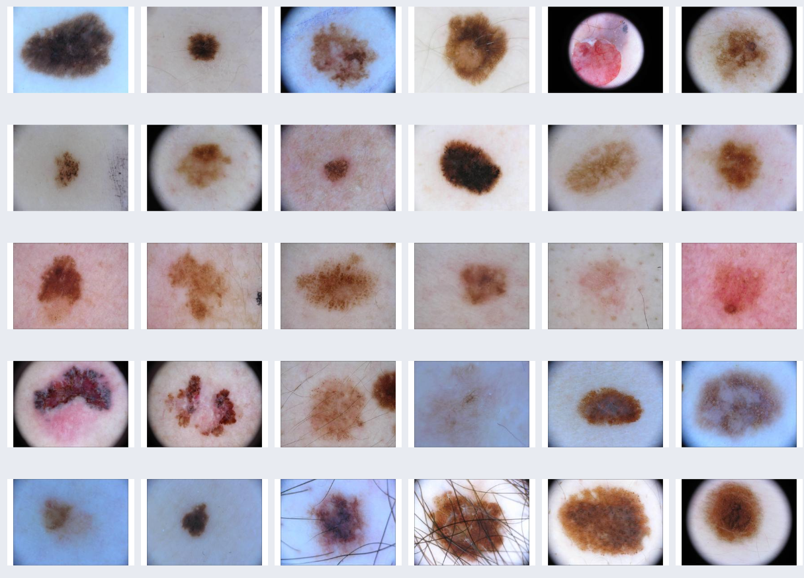

# Skin Cancer Research: A Deep Survey (Keep Updating)

<div align="center">


[](https://github.com/yourname/Skin-Cancer-Survey)  
[](https://github.com/yourname/Skin-Cancer-Survey)  
[](https://github.com/yourname/Skin-Cancer-Survey)  

</div>

---

<div align="center">
  
</div>

<div align="center">
  <sub>上图展示了 HAM10000 数据集中皮肤病变图像的部分示例，包括良性痣与恶性黑色素瘤等多种类型。</sub>
</div>

---

📧 联系邮箱：**lzy13764449097@gmail.com**

---


## 简介（Introduction）

本项目整理并持续更新皮肤癌研究中具有代表性的**深度学习方法、数据集、代码与论文资源**，特别关注 2024–2025 年度的新进展，包括：

- Transformer 与 Diffusion 模型在医学图像中的应用
- 多模态融合（图像 + 临床/文本/基因组）
- 自监督学习与跨模态诊断
- 精准分类、分割与检测任务

希望为皮肤癌影像学研究人员提供一个高效检索与参考的开源平台。如有补充建议，欢迎联系邮箱📮：**lzy13764449097@gmail.com**


## 🌞 Introduction

This repository presents a curated collection of representative **papers**, **datasets**, **methods**, and **codes** on **skin cancer classification, segmentation, and detection** using deep learning, particularly focused on the latest progress in 2024–2025.

We aim to **continuously update** this resource to help researchers navigate through new trends like **transformer-based models**, **diffusion models**, and **multi-modal fusion**.

For collaboration or suggestions, feel free to contact us!

---

## 🧠 Method Taxonomy

### 🎯 Based on Task Type
- **Classification**: Lesion classification (e.g., melanoma vs benign)
- **Segmentation**: Precise boundary delineation of lesions
- **Detection**: Localizing skin cancer regions on dermoscopic/clinical/WSI images
- **Multi-modal Fusion**: Combining image + clinical/meta/genomic data

### 🧪 Based on Model Type
- **CNN-based**: ResNet, DenseNet, MobileNet, EfficientNet
- **Transformer-based**: Swin-T, MedFormer, DS-Former
- **Diffusion-based**: BS-Diff, LeFusion
- **Multimodal Fusion**: Vision + Metadata (e.g., M3Former, MetaNet)
- **Self-Supervised**: SimCLR, SSL-SEFP, BYOL
- **GANs / Adversarial**
- **Ensemble / Voting models**

---

## 📚 Representative Papers (2024–2025)

| Title | Task | Method | Venue | Dataset | Link |
|-------|------|--------|-------|---------|------|
| A Unified Multimodal Foundation Model for Patch-WSI Histopathology | 分类 | CPath-Omni | CVPR | Patch级数据集和WSI级数据集 | [Search](https://scholar.google.com/scholar?q=A+Unified+Multimodal+Foundation+Model+for+Patch-WSI+Histopathology) |
| On the Out-Of-Distribution Generalization of Large Multimodal Models | 其他 | GPT-4V / Gemini 泛化评估 | CVPR | 合成 CMNIST, RMNIST 等 | [Search](https://scholar.google.com/scholar?q=On+the+Out-Of-Distribution+Generalization+of+Large+Multimodal+Models) |
| Multi-faceted Hierarchical Graph-based GNN for Spatial Transcriptomics | 其他 | MERGE 图神经网络 | CVPR | Her2ST, SCC | [Search](https://scholar.google.com/scholar?q=Multi-faceted+Hierarchical+Graph-based+GNN+for+Spatial+Transcriptomics) |
| Interactive Medical Image Analysis with Concept Reasoning | 其他 | CSR（Concept-based Similarity Reasoning） | CVPR | TBX11K, VinDr-CXR, ISIC | [Search](https://scholar.google.com/scholar?q=Interactive+Medical+Image+Analysis+with+Concept+Reasoning) |
| Minding Fuzzy Regions: A Data-driven Alternative to EM in Segmentation | 分割 | DALE | CVPR | ISIC-2016, PH2 | [Search](https://scholar.google.com/scholar?q=Minding+Fuzzy+Regions:+A+Data-driven+Alternative+to+EM+in+Medical+Segmentation) |
| Interactive Medical Image Segmentation Benchmark (IMed-361M) | 分割 | IMIS Baseline | CVPR | IMed-361M | [Search](https://scholar.google.com/scholar?q=Interactive+Medical+Image+Segmentation:+A+Benchmark+Dataset) |
| DSCIMABNet: Deep Skin Cancer Multimodal Attention-Based Net | 检测 | DSCIMABNet + 集成学习 | PR | ISIC 2018, Mendeley | [Search](https://scholar.google.com/scholar?q=DSCIMABNet:+A+novel+multi-head+attention+depthwise+network+for+skin+cancer+diagnosis) |
| kMaXU: Medical Image Segmentation with k-means Mask | 分割 | CNN + Transformer + k-means | PR | ISIC 2018, Mendeley | [Search](https://scholar.google.com/scholar?q=kMaXU:+Medical+image+segmentation+U-Net+with+k-means+mask) |
| DAUD: Domain Adaptation for Unsupervised Skin Cancer Detection | 检测 | 自编码器 + 随机潜变量 | MICCAI | ISIC 2018, Mendeley | [Search](https://scholar.google.com/scholar?q=Domain+Adaptation+for+Unsupervised+Cancer+Detection+in+Skin+Images) |
| SkinCON: Towards Consensus for Uncertainty in Diagnosis | 其他 | DRAPS + 不确定性量化 | MICCAI | SkinCON (ISIC 2019 扩展) | [Search](https://scholar.google.com/scholar?q=SkinCON:+Towards+Consensus+for+the+Uncertainty+Estimation+in+Skin+Diagnosis) |
| Lesion-Aware GAN for Skin Cancer Augmentation | 生成 | 对抗式生成 | WACV | ISIC, PH2 | [Search](https://scholar.google.com/scholar?q=Lesion-Aware+GAN+for+Skin+Cancer+Augmentation) |
| Few-shot Meta Segmentation for Skin Cancer | 分割 | 原型网络 + 领域自适应 | PR | ISIC 2016–2020 | [Search](https://scholar.google.com/scholar?q=Few-shot+Meta+Segmentation+for+Skin+Cancer) |
| Uncertainty-guided Semi-supervised Segmentation | 分割 | U-SAM + 蒸馏机制 | TMI | ISIC 2018 | [Search](https://scholar.google.com/scholar?q=Uncertainty-guided+Self-training+for+Semi-supervised+Skin+Cancer+Segmentation) |
| SSL-SEFP: Self-supervised Patch Fusion for Eyelid Melanoma | 分类 | Patch融合 + 多尺度对比学习 | JBHI | ZJU-2, PatchCamelyon | [Search](https://scholar.google.com/scholar?q=SSL-SEFP:+Self-supervised+Fusion+Patch+Learning+for+Eyelid+Melanoma) |
| Multiscale Fusion Transformer for Lesion Classification | 分类 | Transformer + 多尺度融合 | TMI | ISIC 2019 | [Search](https://scholar.google.com/scholar?q=Multiscale+Fusion+Transformer+for+Lesion+Classification+in+Skin+Cancer) |


## 📊 常用皮肤癌数据集总览（2024）

| Dataset Name       | Number of Lesions (or Classes) | Size (Smallest) | Link                                                                                             |
|--------------------|-------------------------------|------------------|--------------------------------------------------------------------------------------------------|
| ISIC 2016          | 2                             | 1024 × 768       | [Link](https://challenge.isic-archive.com/data/#2016)                                           |
| ISIC 2017          | 1                             | 540 × 576        | [Link](https://challenge.isic-archive.com/data/#2017)                                           |
| ISIC 2018, 36      | 7                             | 1022 × 767       | [Link](https://challenge.isic-archive.com/data/#2018)                                           |
| ISIC 2019, 36, 37  | 8                             | 256 × 256        | [Link](https://challenge.isic-archive.com/data/#2019)                                           |
| ISIC 2020          | 2                             | 640 × 480        | [Link](https://challenge.isic-archive.com/data/#2020)                                           |
| ISIC 2024          | 2                             | 133 × 133        | [Link](https://challenge2024.isic-archive.com/)                                                 |
| BCN20000           | Not specified                 | 1024 × 1024      | [Link](https://figshare.com/articles/journal_contribution/BCN20000_Dermoscopic_Lesions_in_the_Wild/24140028/1) |
| HAM10000           | 7                             | 450 × 600        | [Link](https://dataverse.harvard.edu/dataset.xhtml?persistentId=doi:10.7910/DVN/DBW86T)         |
| PH2                | 1                             | 560 × 768        | [Link](https://www.fc.up.pt/addi/ph2%20database.html)                                           |
| MED-NODE           | 2                             | 201 × 257        | [Link](https://www.cs.rug.nl/~imaging/databases/melanoma_naevi/)                                |
| DERM7PT            | 19                            | 474 × 626        | [Link](https://derm.cs.sfu.ca/Welcome.html)                                                     |
| PAD-UFES-20        | 6                             | 147 × 147        | [Link](https://data.mendeley.com/datasets/zr7vgbcyr2/1)                                         |
| Fitzpatrick17, 39  | 3                             | 66 × 130         | [Link](https://github.com/mattgroh/fitzpatrick17k)                                              |
| MRA-MIDAS          | 16                            | iPhone/iPad Photo| [Link](https://aimi.stanford.edu/datasets/mra-midas-Multimodal-Image-Dataset-for-AI-based-Skin-Cancer) |
| SkinCancer         | 16                            | 395 × 395        | [Link](https://www.frontiersin.org/journals/oncology/articles/10.3389/fonc.2022.1022967/full)   |
| SKINL2             | 8                             | 7716 × 5364      | [Link](https://www.it.pt/AutomaticPage?id=3459)                                                 |


---

## 🌀 Diffusion Models in Skin Imaging


---

## 🎯 Application Scenarios

- Skin lesion classification
- Lesion boundary segmentation
- Multi-modal diagnosis (image + metadata)
- Rare lesion synthesis
- Early screening and triage
- Clinical explainability & uncertainty estimation


---

## 📈 Star History

[](https://star-history.com/#yourname/Skin-Cancer-Survey&Timeline)

---

## 🧾 Citation

### BS-LDM (JBHI 2025)
```bibtex
@article{sun2025bs,
  title={BS-LDM: Effective Bone Suppression in High-Resolution Chest X-Ray Images with Conditional Latent Diffusion Models},
  author={Sun, Yifei and Chen, Zhanghao and others},
  journal={IEEE Journal of Biomedical and Health Informatics},
  year={2025}
}
